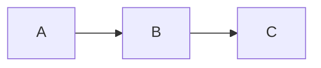

# orz-slides — design spec

A `.slides.html` is **one portable file** that opens in any browser as a
presentation, is authored in **orz-markdown** with a **layout syntax**, and
carries a **pop-out per-slide editor** so it can be edited and saved without any
tooling. It is the slide-deck sibling of
[orz-mdhtml](../orz-mdhtml) — same philosophy (deck-first, quietly editable,
self-contained, browser-delivered engine), built on **reveal.js** for the deck
mechanics and **orz-markdown** for content.

> Status: **published MVP** (`orz-slides` + `orz-slides-browser` v0.1.1). The
> authoring syntax, engine, themes, editor, speaker view, fragments, timer, slide
> numbers, progress bar, and npm packaging are built. PDF export is the remaining
> planned presenter extra.

---

## 1. Goals

- **Portable & self-contained.** One `.slides.html` opens and presents in any
  modern browser. The default `--inline` embeds the engine, reveal's core CSS,
  and all themes; `--cdn` keeps files smaller by using jsDelivr.
- **Authored in orz-markdown.** Slides are markdown (math, mermaid, smiles, qr,
  tabs, containers) — never hand-written HTML.
- **Layout by space division.** A small comment-based syntax divides each slide
  into regions; each region holds orz-markdown.
- **Editable in-browser.** A per-slide pop-out editor (CodeMirror + live
  preview) edits the slide source and saves back into the file.
- **Template-driven structure slides.** Title / section / outline / closing
  pages come from a small gallery of templates.
- **Presenter-grade.** Navigation, overview, speaker notes + timer are built;
  browser-print PDF export remains planned.

## 2. Non-goals (at least initially)

- Not a VS Code extension (that is the existing `orz-slides-html`). Editing lives
  in the file.
- Not an AI-metadata-regeneration format. The markdown *is* the source; there is
  no `instructions`/`contents` generate loop.
- Not a pixel-design tool. Layout is structural (regions), not free-form drag.
- No real-time multi-user collaboration.

## 3. Relationship to the family & reuse

| Reused from orz-mdhtml | Reused from orz-slides-html (extension) | New here |
|---|---|---|
| In-file runtime; CodeMirror; morphdom live preview; FS-Access + IndexedDB save; theme picker; copy-as-markdown; CDN delivery + version check; served-page notice; CLI generator + lockstep browser bundle | reveal.js integration; the 7 slide themes (CSS); library set (KaTeX/mhchem/SmilesDrawer/Mermaid/Chart.js); `<aside class="notes">` for speaker notes; "valid standalone HTML" principle; agent-skill structure | Layout syntax + parser; deck source format; per-slide pop-out editor; slide nav / overview / reorder UI; template gallery; **overflow/fit handling** |

orz-markdown rendering comes from the dedicated `orz-slides-browser` bundle,
which embeds reveal.js, orz-markdown, the slide parser/layout engine, and the
runtime.

---

## 4. File model & source of truth

The `.slides.html` is a normal HTML file. The **source of truth is the embedded
deck source** — a single text block holding everything the author writes
(deck config + all slides). On load the app renders the deck from it; **Save
re-serializes it** (self-reproducing, exactly like orz-mdhtml's `#orz-src`).

```html
<script type="text/orz-slides" id="orz-deck">
  ...deck config + slides (authoring source)...
</script>
```

Everything else in the file — reveal.js scaffold, the app runtime, CDN links —
is regenerated on save and never the source of truth. Opened without JS the file
can show a pre-rendered static deck (progressive enhancement, optional).

### Deck source structure

```
<!-- deck
  title: Controlled Polymerization
  theme: executive
  ratio: 16:9
  author: Dr. Yu Wang
-->

<!-- slide template=title -->
# Controlled Polymerization
## RAFT vs ATRP
**Dr. Yu Wang** · Louisiana · 2026

<!-- slide 2col 3/2 -->
## Results
<!-- @left -->
- Accuracy **92%**
<!-- @right -->
{{smiles C(=S)(SC)SC}}
```

(`ratio: 16:9` is the slide *aspect ratio* — a deck-config value, hence `:`; the
`3/2` on the slide is a layout *track ratio*, hence `/`.)

- A leading `<!-- deck … -->` block holds **deck-level config** (YAML-ish
  key/values): `title`, `theme`, `ratio` (16:9 / 4:3), `author`, default
  `transition`, etc. Optional.
- Each slide starts at a **`<!-- slide … -->` marker**, which is *also the slide
  separator*. The marker carries the layout (preset or grid) and per-slide
  options.

---

## 5. Authoring syntax (the core)

### 5.1 Slide markers

```
<!-- slide -->                        single region (plain markdown slide)
<!-- slide 2col 3/2 -->               preset with a track ratio
<!-- slide col 3/2 { main; side } --> a raw split (same grammar as presets)
<!-- slide template=title -->         a structure-page template
<!-- slide 2col bg=#0b3 t=fade -->    options: background, transition, fit, id
```

Per-slide options (all optional): `bg=` (color/image), `t=` (transition),
`fit=` (fit/scroll/off), `class=`, `id=`, and the bare flag `step` (step-reveal:
auto-tag the slide's content as reveal fragments — lists reveal per item, other
top-level blocks one at a time, in document order). For per-block control,
`{{attrs[.fragment]}}` marks an individual paragraph/heading/block as a fragment.
(Vertical sub-slides via `down` are still reserved — see §17.)

Track ratios always use `/` (CSS-aligned, e.g. `3/2`, `auto/1fr`); `:` is
reserved for `key: value` in the deck config — one symbol, one meaning.

### 5.2 The slide frame & heading rule

Every **normal slide** has the same vertical frame — three bands, the middle one
divided by the slide's layout:

```
┌─────────────────────┐
│   title band        │  ← the slide's leading h2 (auto-lifted)
├─────────────────────┤
│   content area      │  ← divided by the layout grammar (§5.3)
├─────────────────────┤
│   footer band       │  ← optional (deck footer and/or @footer)
└─────────────────────┘
```

Headings are **tightly scoped** so a heading's role is never ambiguous — one
rule per heading level:

| Level | Role |
|---|---|
| **h1** | Only on **title pages** (`template=title`) — the presentation title. Not allowed on a normal slide. |
| **h2** | The **slide title** of a normal slide. Exactly one, and it is the slide's first content. A second h2 (or an h1) on a normal slide is a **lint error** flagged in the editor. |
| **h3–h6** | In-slide sub-headings (ordinary markdown). |

The leading h2 is lifted into the title band automatically — you never place it
in a region. So a titled two-column slide is just:

```
<!-- slide 2col -->
## Results          ← title band (spans the slide)
<!-- @left -->  …
<!-- @right --> …
```

### 5.3 Region markers

Content is split into regions by `<!-- @name -->`. A region's body (until the
next marker) is orz-markdown, rendered by orz-markdown and placed in that region.
Content before the first marker goes to the layout's **primary region** (the
first leaf).

```
<!-- slide main-side 2/1 -->
## Architecture
<!-- @main -->

<!-- @side -->
- ingest
- transform
- serve
<!-- @footer -->
Internal · v3 · 2026
<!-- @notes -->
Remember to explain back-pressure.
```

Three region names are **reserved** with fixed meaning (consistent across every
layout): `<!-- @notes -->` → reveal's `<aside class="notes">` (speaker notes,
never shown); `<!-- @footer -->` → this slide's footer band (deck-wide footer set
once via `<!-- deck footer: … -->`); and **`<!-- @float … -->`** (below).

### 5.5 Float containers

A **float** is a free-positioned overlay box, **outside the grid**, layered on
top of the layout at a fixed position and size. Use it for the occasional badge,
callout, watermark, logo, or pull-out figure. Typically **zero** per slide,
occasionally one or two — the author is responsible for placement and order.

```
<!-- @float left=58% top=10% w=36% h=44% -->
> Key takeaway: **narrow PDI** across all methods.
```

- Geometry attributes (percent of the slide, or `px`): any of `left` `right`
  `top` `bottom` `w` `h`; optional `z=` (default = declaration order, so a later
  float sits on top). The body is orz-markdown rendered inside the box.
- Floats are **repeatable** (each `<!-- @float … -->` is its own overlay) and are
  the one place the grid is escaped — kept deliberately separate so the layout
  grammar stays purely structural.

### 5.4 The layout grammar (recursive splits — the one rule)

The content area is divided by **one rule applied recursively**: split a box into
**rows** or **columns**; each cell is a **named region** or **another split**.

```
split  := ("row" | "col") tracks "{" item (";" item)* "}"
item   := region-name | split
tracks := token ("/" token)*        // 2/1 · auto/1fr/auto · 30%/1fr · 200px/1fr
```

- `col 2/1 { left; right }` — two columns, 2:1.
- `row auto/1 { head; col 1/1 { a; b } }` — a header row above two columns.
- Leaves are **region names**, filled by `<!-- @name -->`. Names are **flat and
  unique** regardless of nesting depth (the nesting lives in the layout, not the
  names) — so a region marker is always just `<!-- @side -->`.

Because the rule is recursive, **headers, footers, sidebars, quadrants, and
arbitrary grids are all just splits** — nothing is special-cased. This is what
makes new templates easy to build and lets you combine layouts any way:

```
<!-- slide row auto/1/auto { banner; col 3/2 { main; row 1/1 { fig; note } }; bar } -->
```

### 5.4.1 Presets = named layouts (aliases)

Presets are **aliases** that expand to the grammar, so the everyday case stays
terse. They are sugar, not a separate system:

| Preset | Expands to | Regions |
|---|---|---|
| (none) | single region | `body` |
| `2col [a/b]` | `col a/b { left; right }` | left, right |
| `3col` | `col 1/1/1 { left; mid; right }` | left, mid, right |
| `2row [a/b]` | `row a/b { top; bottom }` | top, bottom |
| `main-side [a/b]` | `col a/b { main; side }` (default 2/1) | main, side |
| `quad` | `row 1/1 { col 1/1{tl;tr}; col 1/1{bl;br} }` | tl, tr, bl, br |

Use a preset, a raw split, or mix freely; both forms expand to the same tree, so
the renderer and editor only implement one thing.

> The earlier "explicit grid escape hatch" is gone — the split grammar **is** the
> general case, so there is one layout mechanism, not two.

### 5.5 Structure-page templates

Templates are **special presets with fixed semantics and dedicated styling**,
chosen with `template=`. They read a few markdown fields rather than free
regions:

- **`title`** — title (`#`), subtitle (`##`), author/date line. Centered,
  accent styling.
- **`section`** — a divider: section number + big section title.
- **`outline`** — an agenda list; the *current* item can be highlighted
  (`<!-- @here -->` or a marker on the list item).
- **`closing`** — thanks / contact / a {{qr}} to a link.

Templates are themselves **defined with the §5.4 grammar** (a split tree +
styling + which markdown fields fill which regions), so adding a new template is
just authoring a layout — no special engine support. A small **gallery** offers a
few visual variants per template (e.g. 3 title layouts), selectable in the
editor; the choice is stored as `template=title v=2`.

---

## 6. Rendering pipeline

```
#orz-deck source
  → parse deck config + split slides at <!-- slide --> markers
  → per slide:
      parse layout marker → grid spec (cols/rows/areas) + region list
      extract title line + each <!-- @region --> body
      render each region body via orz-markdown (orz-mdhtml-browser)
      assemble <section> = themed title bar + CSS-grid of region .markdown-body's
      pull @notes → <aside class="notes">
  → inject all <section>s into .reveal .slides; Reveal.initialize()
  → run client enhancers across the deck: KaTeX, mermaid, SmilesDrawer, qr, charts
  → apply per-slide fit/scale (see §7)
```

Editing one slide re-runs steps for that slide only and calls `reveal.sync()`.

---

## 7. Overflow / fit — the hard problem

Fixed-size slides + arbitrary markdown = overflow. Strategy, in order:

1. **Default `fit`:** after layout, measure each region's content vs its box; if
   it overflows, scale the region's font-size down (CSS `--region-scale`, via a
   transform or font scaling) to a floor (e.g. 60%). Most mild overflows vanish.
2. **`fit=scroll`:** region scrolls instead of scaling (for reference-heavy
   slides).
3. **`fit=off`:** no adjustment (author takes responsibility).
4. **Editor warning:** the pop-out editor flags "content overflows / was scaled
   to N%" so the author can split the slide.

This is the **corrective** side of overflow; the **preventive** side is the
agent **capacity budgets** in §14 (author within limits in the first place).
Together they keep "write markdown, get a slide" honest. The scale mechanism
needs an **early prototype** (Phase 0) — it's the make-or-break.

---

## 8. The in-browser app

### Modes

- **Present (default):** clean reveal deck. Keyboard/touch nav, fullscreen (F),
  overview (ESC), speaker view (S). One small **edit** affordance + a slim deck
  bar (theme, add-slide, overview) that auto-hides.
- **Edit a slide (pop-out):** an overlay over the current slide — **CodeMirror**
  with that slide's source beside a **live preview of just that slide**
  (morphdom incremental update). Controls: pick template/layout, edit notes,
  prev/next slide, done. Save writes the whole file.
- **Overview/organize:** reveal's overview (thumbnails) plus **drag-to-reorder**,
  add / duplicate / delete slide.

### Reused editor stack (from orz-mdhtml)

CodeMirror (markdown mode), morphdom live preview, **FS-Access in-place save +
IndexedDB handle reuse + download fallback + served-page "download a copy"
notice**, theme picker, copy-as-markdown, lazy-load editor libs on first edit,
version-check banner. Save serializes the outer document with the updated
`#orz-deck`.

### Deck operations

Add/duplicate/delete/reorder slides; change a slide's template/layout; set deck
theme & ratio; edit title/outline pages through their template fields.

---

## 9. Self-containment, delivery, save

Identical model to orz-mdhtml:

- **Delivery:** default `--inline` embeds the engine (`orz-slides-browser`),
  reveal's core CSS, and all seven themes so text decks present and switch
  themes offline. `--cdn` loads the engine, reveal CSS, and active theme from
  jsDelivr for smaller files. Math/diagram/chart/editor libraries still load
  from CDN on demand.
- **Save:** self-reproducing; Chromium in-place via File System Access API +
  persisted handle; download elsewhere; served pages prompt to download a copy.
- **Viewing text-only inline decks works offline.** Decks using math, diagrams,
  charts, or the in-browser editor need internet for those libraries.

---

## 10. Themes

Slide themes are reveal.js-compatible CSS that **also style `.markdown-body`
content** inside regions (so markdown looks right on a slide). Port the
extension's 7 (Paper, Architect, Executive, Sage, Poppy, Neon, Chalk) + a base.
Theme switch swaps one `<link>`; the choice is saved in deck config. The orz
content themes and the slide themes must be reconciled into a single per-theme
stylesheet.

## 11. Special content & enhancers

orz-markdown plugins render the source; client enhancers run inside the deck:
**KaTeX** (math/mhchem), **Mermaid** (diagrams), **SmilesDrawer** (chemistry),
**{{qr}}** (links), and **charts**. *Decided:* add a **`{{chart}}` plugin to
orz-markdown core** for simple plots/bar/line/pie (Chart.js under the hood). It
emits a `data-md` breadcrumb like the other generated constructs, so it
round-trips through copy-as-markdown — and it benefits `.md.html` too, not just
slides. This is a small, self-contained orz-markdown task that can land
independently. Enhancers re-run per slide on edit (idempotent), reusing the
orz-mdhtml pattern (incl. the SMILES canvas-size/redraw fixes already solved).

## 12. Export

- **PDF:** reveal's `?print-pdf` route + browser print. Provide a one-click
  "Export PDF" that opens print mode.
- **Clean deck:** export a presentation-only `.slides.html` (or `.html`) with the
  editor stripped, for distribution.
- **Speaker notes** travel in `<aside class="notes">`.

## 13. Packages & repo

Mirror orz-mdhtml:

```
orz-slides/                  new repo + npm package (CLI: orz-slides foo.md → foo.slides.html)
  src/cli.ts                 generate a .slides.html from a deck source (.md-ish)
  src/template.ts            the .slides.html shell (reveal scaffold + #orz-deck + app)
  src/slide-parser.ts        deck source → slides → grid specs  (the core)
  src/browser-entry.ts       window.orzslides: render deck + reveal init  (bundled)
  assets/app.js              in-file runtime: present/edit modes, pop-out editor, save
  assets/themes/*.css        the 7 slide themes + base
  browser/                   orz-slides-browser package (engine bundle for CDN)
  orz-slides-skills/SKILL.md agent skill: how to author/edit .slides.html
  CLAUDE.md
```

**Engine bundle — one combined `orz-slides-browser`** (recommended: *easier to
maintain*). It is `esbuild(reveal.js + orz-markdown + slide-parser + runtime)`,
versioned in lockstep with the CLI, served via jsDelivr.

Why one bundle rather than reusing `orz-mdhtml-browser` + a separate slides
bundle: a single artifact means **one version to track and one release flow** (no
cross-package version coordination), each `.slides.html` loads **one** engine
script instead of two, and orz-slides can pin its own orz-markdown version
independently of orz-mdhtml. The only cost — orz-markdown is bundled again
(~700 KB) — is paid once per CDN cache and matches the family's existing pattern
(every project ships its own `*-browser` bundle).

## 14. Agent skill + guidance

A bundled `orz-slides` skill teaching agents the deck source format, the layout
presets/regions, templates, and authoring do/don'ts (so an agent can draft a
deck from notes). Plus a `CLAUDE.md` for contributors (mirroring the family),
including the standing "update README + skill after each major revision" rule.

### Capacity budgets (so agents don't overflow)

The skill includes **per-container content budgets** so an agent fills slides
without overrunning them — scale-to-fit (§7) is a safety net, **not** a licence
to overflow. Budgets are heuristics for a **16:9 slide at the default theme
font**, and **scale with a region's area** (a half-width column gets ~half a
full body's budget; a quad cell ~a quarter):

| Container | Budget (16:9, default font) |
|---|---|
| Slide title (h2) | ≤ ~10 words, 1 line |
| Title-page title (h1) | ≤ ~8 words |
| Full body (single region) | ≤ ~6 bullets **or** ~55 words **or** ~14 code lines |
| One column of `2col` | ≤ ~5 bullets / ~35 words |
| One cell of `3col` / `quad` | ≤ ~3–4 bullets / ~20 words |
| `side` (in `main-side`) | ≤ ~4 short bullets, or one small figure |
| Bullet line | ≤ ~10 words, 1 line; avoid nesting beyond 1 level |
| Table | ≤ ~6 rows × 4 cols (full width); fewer in a column |
| Code block | ≤ ~12 lines full / ~8 in a column |
| Figure / diagram / chart | one primary visual per region |

Core rule for agents: **prefer splitting into another slide over crowding one.**
Budgets shrink proportionally for `4:3` and for smaller regions; the skill states
the formula (`budget ≈ baseline × region-area-fraction`) so an agent can reason
about any nested split.

---

## 15. Risks & how we de-risk

| Risk | Mitigation |
|---|---|
| **Overflow/fit** (biggest) | Phase-0 prototype of scale-to-fit before committing the architecture |
| Editing inside reveal's DOM | Keep slide *source* in `#orz-deck`; regenerate one `<section>` + `reveal.sync()` on edit |
| Theme reconciliation (reveal vs markdown content) | Per-theme CSS that styles both; port + adapt the 7 |
| Self-contained + reveal PDF/speaker plugins from one file | Verify print-pdf + notes plugin from `file://`/served early |
| Layout syntax ergonomics | Lock the preset/region grammar in this spec; user-test with real decks |
| Bundle size (reveal + orz-markdown) | `--inline` default for portability, optional `--cdn` for small files; lazy-load editor libs |

## 16. Phased roadmap

- **Phase 0 — spike (throwaway):** markdown → grid regions → reveal `<section>`,
  and the overflow scale-to-fit. Validate the two riskiest unknowns.
- **Phase 1 — MVP:** deck format + parser (presets only); render to reveal;
  present mode; **single-slide pop-out editor**; save; 1–2 themes; math/mermaid/
  smiles.
- **Phase 2:** template gallery (title/section/outline/closing); theme picker
  (port 7); overview / reorder / add / delete; copy-as-markdown; explicit-grid
  syntax.
- **Phase 3:** ~~speaker view~~ ✅; ~~charts~~ ✅; ~~qr~~ ✅; ~~fragments~~ ✅
  (slide-level `step` flag + `{{attrs[.fragment]}}`); ~~slide numbers + progress
  + timer~~ ✅; transitions (per-slide `t=`, deck `transition:`); ~~CLI + npm
  (lockstep browser bundle)~~ ✅ (published v0.1.1); ~~agent skill~~ ✅;
  ~~CLAUDE.md~~ ✅. **Remaining: PDF export.**

---

## 17. Decisions

**Resolved (this review round):**

1. **Deck config** → `<!-- deck … -->` comment block. ✅
2. **Slide separator** → every slide must start with `<!-- slide … -->`; no bare
   `---` (one unambiguous rule). ✅
3. **Charts** → add a `{{chart}}` plugin to **orz-markdown core** (reusable in
   `.md.html` too; round-trips via `data-md`). ✅
4. **Headings** → tight rule: **h1 = title pages only; h2 = the single slide
   title; a second h2 / any h1 on a normal slide is a lint error.** ✅
5. **Layout model** → one recursive **row/col split** grammar; presets are
   aliases; header/footer/grids are just splits (nesting + footer supported). ✅
6. **Track ratios** → `/` (CSS-aligned); `:` reserved for `key: value`. ✅
7. **Engine bundle** → one combined `orz-slides-browser` (easier to maintain). ✅
8. **Float containers** → reserved repeatable `<!-- @float … -->` overlay region
   with explicit geometry; the one escape from the grid. ✅
9. **Capacity budgets** → the agent skill encodes per-container content budgets
   (preventive) to complement scale-to-fit (corrective). ✅

**Still open (later phases — design before building):**

- ~~**Fragments / step reveals:** how to mark them~~ — **Resolved:** a bare
  slide flag `step` auto-tags the slide's content as reveal fragments (lists per
  item, other top-level blocks in document order); `{{attrs[.fragment]}}` marks
  an individual block. `step` stays consistent with the existing flag grammar;
  per-item list fragments are why a region flag (not just `{{attrs}}`) was
  needed — orz-markdown's attrs can't land a class on an `<li>`. ✅
- **Vertical sub-slides (`down`):** include or drop. Adds a nesting axis to the
  deck (not just the layout); leaning *drop* unless a real need appears, to keep
  the deck a flat sequence (consistency).
- **Template gallery contents:** how many variants per template, and their exact
  field mappings — settle when building Phase 2.
- **Overflow scale mechanism:** font-scaling vs CSS transform vs `svg`-style
  fit — pick after the Phase-0 spike measures real behavior.
