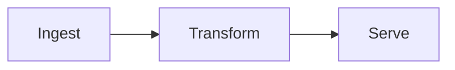

# orz-slides — author a `.slides.html` deck

`orz-slides` turns a **deck source** into **one `.slides.html` file** that:

- presents in any modern browser (reveal.js: keyboard/touch nav, slide overview),
- is authored entirely in **orz-markdown** (math, mermaid, smiles, qr, charts,
  tabs, containers) with a small **layout syntax**,
- can be **edited in the browser** (per-slide pop-out CodeMirror editor + live
  preview) and **saves itself** back into the file.

The deck source is the single source of truth, embedded in the file:

```html
<script type="text/orz-slides" id="orz-deck">
  ...deck config + slides (this is what you write)...
</script>
```

You write only the **deck source**. Never hand-write the surrounding HTML
(reveal scaffold, runtime, CDN links) — saving regenerates it. To change a deck,
edit the deck source (in a `.md`-ish file fed to the CLI, or in-browser) and let
the tool re-serialize.

> Status: orz-slides is **published to npm** (v0.8.5) as two lockstep packages —
> the `orz-slides` CLI and the `orz-slides-browser` engine. Generate decks with
> the CLI (`npx orz-slides deck.md`, or install it globally). Speaker view
> (**S**), step-reveal fragments, an on-deck timer (**T**), and slide numbers are
> wired; **PDF export** is the remaining planned presenter feature.

## When to use it

- A user wants a **single shareable file** that presents like a slide deck with
  no install — email it, host it, open it offline-of-tooling in a browser.
- The content is **markdown-native** (bullets, math, diagrams, chemistry, code)
  and the author wants slides without a pixel-design tool.
- Prefer `.md.html` (orz-mdhtml) when the output is a *document* to read/annotate;
  prefer `.slides.html` (orz-slides) when it is a *deck* to present.

---

## The deck source format

A deck source is plain text: an optional leading `<!-- deck … -->` config block,
then a sequence of slides. **Every slide begins with a `<!-- slide … -->`
marker** — that marker is also the slide separator. There is no bare `---`.

```
<!-- deck
  title: Controlled Polymerization
  theme: executive
  ratio: 16:9
  author: Dr. Yu Wang
  footer: Internal · v3 · 2026
-->

<!-- slide template=title -->
# Controlled Polymerization
## RAFT vs ATRP
**Dr. Yu Wang** · Louisiana · 2026

<!-- slide 2col 3/2 -->
## Results
<!-- @left -->
- Accuracy **92%**
<!-- @right -->
{{smiles C(=S)(SC)SC}}
```

### Deck config (`<!-- deck … -->`, optional)

YAML-ish `key: value` lines. `:` is for config values; it never appears in a
layout. Keys: `title`, `theme`, `ratio` (`16:9` default, or `4:3`), `author`,
`footer` (deck-wide footer shown on normal slides), `transition` (default reveal
transition).

`title` and `author` also seed the generated document's portable metadata in
standard `<head>` tags and the `#orz-meta` JSON island. Programmatic hosts may
pass richer `metadata` (license, canonical source, date, description, keywords)
to `buildSlidesHtml`; host values win field by field. This metadata affects the
document head only and does not replace the visible footer or deck content.

Theme ids: `paper`, `architect`, `executive`, `sage`, `poppy`, `neon`, `chalk`
(plus a base). Readers can switch live in the editor.

### Slide marker (`<!-- slide … -->`, mandatory)

The marker carries the layout (a preset alias or a raw split) plus per-slide
options:

```
<!-- slide -->                          single region (plain markdown slide)
<!-- slide 2col 3/2 -->                 a preset with a track ratio
<!-- slide col 3/2 { main; side } -->   a raw split (same grammar as presets)
<!-- slide template=title -->           a structure-page template
<!-- slide 2col bg=#0b3 t=fade -->      with options
```

Per-slide options (all optional): `bg=` (color or image), `t=` (transition),
`fit=` (`fit` | `scroll` | `off`, default `fit`), `class=`, `id=`, and the bare
flag `step` (step-reveal — see below). Template variants use `v=` (e.g.
`template=title v=2`).

### Step-reveal fragments

Reveal a slide's content one piece at a time:

- **Whole slide** — add the bare `step` flag: `<!-- slide step -->` (or combined
  with a layout, `<!-- slide step 2col -->`). Lists reveal **per item**; other
  top-level blocks (paragraphs, images, tables) reveal **one at a time**, in
  document order, across all regions.
- **Individual block** — tag it with `{{attrs[.fragment]}}` (orz-markdown attrs),
  e.g. `A revealed paragraph.{{attrs[.fragment]}}`. Note: attrs **cannot** tag a
  list item — use the `step` flag for per-bullet reveal.

### Presenting

reveal.js keyboard nav, plus: **S** opens a dedicated **speaker view**
(current + next slide, the slide's `@notes`, a wall clock and a start/pause/reset
timer; arrows there drive the deck). **T** toggles an on-deck clock/timer
overlay. Slide numbers (`c/t`) and a progress bar show during the presentation.

> Track ratios always use `/` (CSS-aligned: `3/2`, `auto/1fr`, `30%/1fr`).
> `:` is reserved for `key: value` config. One symbol, one meaning.

---

## The slide frame & the heading rule

Every **normal slide** has the same three-band vertical frame:

```
┌─────────────────────┐
│   title band        │  ← the slide's leading h2 (auto-lifted)
├─────────────────────┤
│   content area      │  ← divided by the layout grammar
├─────────────────────┤
│   footer band       │  ← optional (deck footer and/or @footer)
└─────────────────────┘
```

Headings are **tightly scoped** — one rule per level, so a heading's role is
never ambiguous:

| Level | Role |
|---|---|
| **h1** (`#`) | **Title pages only** (`template=title`) — the presentation title. **Not allowed on a normal slide.** |
| **h2** (`##`) | The **slide title** of a normal slide. **Exactly one**, and it is the slide's first content. A second h2 (or any h1) on a normal slide is a **lint error**. |
| **h3–h6** | In-slide sub-headings (ordinary markdown). |

The leading h2 is **auto-lifted** into the title band — never put it inside a
region. A titled two-column slide is simply:

```
<!-- slide 2col -->
## Results          ← becomes the title band (spans the slide)
<!-- @left -->  …
<!-- @right --> …
```

---

## Regions (`<!-- @name -->`)

The content area is split into **regions**, one per layout leaf. A region's body
runs from its `<!-- @name -->` marker to the next marker and is rendered as
orz-markdown. Content **before** the first region marker goes to the layout's
**primary region** (the first leaf), so a single-region slide needs no markers
at all.

Region names are **flat and unique per slide**, regardless of nesting depth —
the nesting lives in the layout, not the names. A marker is always just
`<!-- @side -->`.

### The three reserved regions

These names have fixed meaning in **every** layout:

| Marker | Meaning |
|---|---|
| `<!-- @notes -->` | Speaker notes → reveal's `<aside class="notes">`. **Never shown** on the slide; stored in the deck, round-tripped on save, and shown in the **speaker view** (press **S** while presenting). |
| `<!-- @footer -->` | This slide's footer band — shows on that slide alone and overrides the deck-wide footer. The deck-wide footer (`<!-- deck footer: … -->`) appears on every slide **except** the opening `title` page; add an `@footer` to a title slide to force one. |
| `<!-- @float … -->` | A **free-positioned overlay**, outside the grid (see below). |

### Floats (`<!-- @float … -->`)

A float is an overlay box layered on top of the layout at a fixed position and
size — the one escape from the grid. Use it sparingly (a badge, callout,
watermark, logo, pull-out figure): **typically zero per slide**, occasionally
one or two.

```
<!-- @float left=58% top=10% w=36% h=44% -->
> Key takeaway: **narrow PDI** across all methods.
```

Geometry attributes (percent of the slide, or `px`): any of `left` `right`
`top` `bottom` `w` `h`; optional `z=` (default = declaration order, so a later
float sits on top). The body is orz-markdown rendered inside the box. Each
`<!-- @float … -->` is its own overlay (repeatable).

---

## The layout grammar (recursive splits)

The content area is divided by **one rule applied recursively**: split a box into
**rows** or **columns**; each cell is a **named region** or **another split**.

```
split  := ("row" | "col") tracks "{" item (";" item)* "}"
item   := region-name | split
tracks := token ("/" token)*        // 2/1 · auto/1fr/auto · 30%/1fr · 200px/1fr
```

- `col 2/1 { left; right }` — two columns, 2:1.
- `row auto/1 { head; col 1/1 { a; b } }` — a header row above two columns.
- Leaves are **region names**, filled by `<!-- @name -->`.

Because the rule is recursive, **headers, footers, sidebars, quadrants, and
arbitrary grids are all just splits** — nothing is special-cased:

```
<!-- slide row auto/1/auto { banner; col 3/2 { main; row 1/1 { fig; note } }; bar } -->
```

### Presets (named layouts — aliases)

Presets are **aliases** that expand to the grammar, so the everyday case stays
terse. They are sugar, not a separate system — use a preset, a raw split, or mix
freely. An optional `[a/b]` sets the track ratio.

| Preset | Expands to | Regions |
|---|---|---|
| *(none)* | single region | `body` |
| `2col [a/b]` | `col a/b { left; right }` | left, right |
| `3col` | `col 1/1/1 { left; mid; right }` | left, mid, right |
| `2row [a/b]` | `row a/b { top; bottom }` | top, bottom |
| `main-side [a/b]` | `col a/b { main; side }` (default `2/1`) | main, side |
| `quad` | `row 1/1 { col 1/1 { tl; tr }; col 1/1 { bl; br } }` | tl, tr, bl, br |

---

## Structure-page templates (`template=`)

Templates are structure pages. A `template=` slide reads structured fields from
its markdown — `# title`, `## subtitle`, then the rest as a meta/byline block —
and lays them out with dedicated styling instead of the region grid. Pick a
layout with `v=` (e.g. `template=title v=2`):

| Template | Write | Layouts (`v=`) |
|---|---|---|
| `title` | `#` title, `##` subtitle, author/date line | **v1** centered + accent rule (default) · **v2** left accent bar · **v3** uppercase kicker · **v4** split (bold accent band beside the title) · **v5** full-color cover (title bottom-left) · **v6** oversized editorial (huge type) |
| `section` | `#` section title (rest = meta) | **v1** underline rule (default) · **v2** centered accent · **v3** surface band + left bar · **v4** outlined box |
| `outline` | an agenda list | **v1** plain (default) · **v2** cards · **v3** two columns |
| `closing` | thanks / contact / a `{{qr}}` | **v1** centered (default) · **v2** full-color cover · **v3** oversized |

All template styling adapts to the active theme (via `--accent` / `--ink` /
`--muted`), light or dark.

---

## Capacity budgets — author within the slide, don't overflow

Scale-to-fit is a **safety net, not a licence to overflow.** These are
per-container budgets for a **16:9 slide at the default theme font**. They
**scale with a region's area**: a half-width column gets ~half a full body's
budget; a quad cell ~a quarter.

| Container | Budget (16:9, default font) |
|---|---|
| Slide title (h2) | ≤ ~10 words, 1 line |
| Title-page title (h1) | ≤ ~8 words |
| Full body (single region) | ≤ ~6 bullets **or** ~55 words **or** ~14 code lines |
| One column of `2col` | ≤ ~5 bullets / ~35 words |
| One cell of `3col` / `quad` | ≤ ~3–4 bullets / ~20 words |
| `side` (in `main-side`) | ≤ ~4 short bullets, or one small figure |
| Bullet line | ≤ ~10 words, 1 line; avoid nesting beyond 1 level |
| Table | ≤ ~6 rows × 4 cols (full width); fewer in a column |
| Code block | ≤ ~12 lines full / ~8 in a column |
| Figure / diagram / chart | one primary visual per region |

**Core rule: prefer splitting into another slide over crowding one.** Budgets
shrink proportionally for `4:3` and for smaller regions; estimate any nested
split with `budget ≈ baseline × region-area-fraction`.

---

## Do / don't

**Do**
- Start every slide with a `<!-- slide … -->` marker.
- Put exactly one `## h2` as the first line of each normal slide (the title).
- Reach for a **preset** first; drop to a raw split only when you need nesting.
- Keep region content under the budgets above; split a crowded slide in two.
- Use `<!-- @notes -->` for speaker notes — they never clutter the slide.
- Use a deck-wide footer (`<!-- deck footer: … -->`) and override per-slide with
  `<!-- @footer -->` only when needed.

**Don't**
- Don't use `#` (h1) on a normal slide, or a second `##` (h2) — both are lint
  errors.
- Don't hand-edit the generated `.slides.html`; edit the deck source.
- Don't use `:` in a layout, or `/` in a config value.
- Don't reuse a region name within a slide (names are unique per slide).
- Don't lean on floats for layout — that is what splits are for. Floats are
  occasional overlays, not the grid.

---

## Example slides

### A titled two-column slide

```
<!-- slide 2col 3/2 -->
## Results at a glance
<!-- @left -->
- Accuracy **92%** across all runs
- Latency under **40 ms**
- Zero regressions in CI
<!-- @right -->
{{chart
type: bar
labels: A, B, C
series: Score = 92, 81, 76
}}
<!-- @notes -->
Lead with accuracy; the latency number is the surprise — pause here.
```

### A nested-split slide (header row over a main + stacked-figures column)

```
<!-- slide row auto/1 { head; col 3/2 { main; row 1/1 { figA; figB } } } -->
## Pipeline architecture
<!-- @head -->
Ingest → transform → serve, with back-pressure between stages.
<!-- @main -->

<!-- @figA -->
{{qrcode https://example.org/spec}}
<!-- @figB -->
*Spec v3 — scan to read.*
```

### A title page

```
<!-- slide template=title -->
# Controlled Polymerization
## RAFT vs ATRP — a practical comparison
**Dr. Yu Wang** · University of Louisiana · 2026
```

---

## Special content & enhancers

Region bodies are full orz-markdown. The deck runs client enhancers, drawn per
visible slide (and re-run on edit): **KaTeX** (math/mhchem, pre-rendered),
**Mermaid**, **SmilesDrawer** (chemistry), and **`{{chart}}`** (simple
bar/line/pie/doughnut via Chart.js — the line-based `type:` / `labels:` /
`series:` config shown above). For the full orz-markdown syntax (containers
`::: name`, `{{name body}}` plugins, `{{attrs[#id .class]}}`, tabs), read the
orz-markdown skill at `node_modules/orz-markdown/orz-markdown-skills/SKILL.md`.

## What the generated file needs at view time

"Self-contained" means *one file*. By default the CLI **inlines** the engine,
reveal's core CSS, and **all seven themes**, so a text deck **presents and
switches themes offline**. The libraries that load from CDN (cached after first
load) are only: KaTeX (math), Mermaid, SmilesDrawer, Chart.js, and CodeMirror
(the editor) — so a deck that uses math/diagrams/charts, or in-browser editing,
needs internet. `--cdn` instead references the engine + theme from jsDelivr
(smaller files, needs network). Editing/Save in place needs a Chromium browser
(File System Access API); presenting works in all modern browsers.

## Security

`.slides.html` files are **single-file executable HTML** — opening one runs its
embedded JavaScript. Treat them like programs: only open or edit files from a
trusted source, and advise users the same. The one-click framework update is
opt-in (edit view only, explicit confirm) and always fetches from the hardcoded
canonical jsDelivr packages — a tampered file can't redirect it. A file's
integrity can't be verified from inside it; for authenticity, verify out-of-band.
See the README "Security" section.
